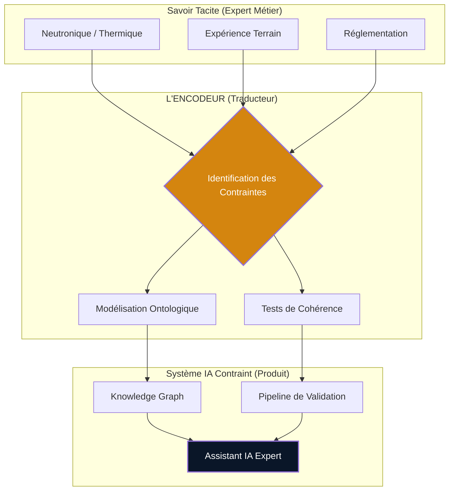

## L'Encodeur de Contraintes

### Le "Pont" de l'Intelligence Physique

L'IA généraliste ne connaît pas les lois de votre domaine. Votre expert métier ne sait pas les écrire dans un pipeline. Le data engineer sait construire le pipeline, mais pas quelles règles y mettre. Trois compétences nécessaires — zéro profil qui les couvre simultanément.

!!! abstract "Visualisation de l'Ontologie Métier (Interactive)"
    

        <iframe src="../assets/knowledge_graph.html" width="100%" height="500px" frameborder="0"></iframe>
    

    *Note : Manipulez le graphe pour explorer les relations entre réacteurs, capteurs et règles physiques encodées.*

---

### Ce que fait l'Encodeur de Contraintes

Je prends le savoir tacite de vos experts métier et je l'encode dans des systèmes qui contraignent l'IA. Concrètement :

| Domaine | Ce que votre expert sait | Ce que j'en fais | Status |
|---|---|---|---|
| **Physique** | "Cette concentration est impossible" | Règle de bornage dans le pipeline | `VALIDATED` |
| **Phases** | "Le comportement change ici" | Arbre de décision opérationnel | `VALIDATED` |
| **Capteurs** | "Ce signal dérive de la référence" | Recalage par assimilation | `VALIDATED` |
| **Artefacts** | "À l'arrêt, cette mesure est fausse" | Règle de cohérence premier rang | `VALIDATED` |
| **Sémantique** | "Ces signaux sont corrélés" | Corrélations dans le Knowledge Graph | `VALIDATED` |

---

### Pourquoi ce profil est rare

Ce n'est pas une compétence unique — c'est une intersection.

La traduction entre physique industrielle, ingénierie des données et IA cognitive est elle-même tacite, contextuelle, forgée par l'expérience. On ne forme pas un traducteur physique-data-IA en bootcamp.

!!! info "Le Filtre CAP — Pourquoi choisir cette approche ?"
    - **Contraint** : La réalité impose une borne que l'IA ne peut pas ignorer.
    - **Aride** : La valeur se cache dans le nettoyage et la validation "ingrate".
    - **Prouvable** : Faisabilité démontrée par un prototype en moins de 3 mois.

---

### Ce que ça change pour le client

??? example "SANS Encodage (Risque Architectural)"
    - L'IA produit des résultats statistiquement corrects mais physiquement faux.
    - L'expert métier valide manuellement chaque sortie — le gain d'automatisation disparaît.
    - Le turnover consultant remet le compteur à zéro à chaque rotation.

??? success "AVEC Encodage (Actif Technique)"
    - Les lois physiques sont codées dans l'architecture — l'IA ne peut pas les violer.
    - L'expert métier supervise le système, il ne le compense plus.
    - Les règles survivent au turnover : elles sont dans le code, pas dans la tête.

> L'encodage de contraintes est une forme d'investissement : le savoir tacite de vos experts devient un **actif technique transférable**. Ce que je livre — prototype fonctionnel, architecture documentée, tests — reste exploitable après mon départ.

---

### La preuve par l'exemple

Depuis mi-2024, j'applique cette approche sur la surveillance des réacteurs nucléaires du parc français :

- **55 constantes physiques** encodées comme bornes inviolables.
- **96,4 % des incohérences** résolues automatiquement via 3 règles de cohérence.
- **1 Knowledge Graph** encodant l'ontologie métier complète.
- **270+ tests unitaires** couvrant chaque règle physique encodée.

→ Résultats détaillés : voir [La Preuve](index.md#la-preuve)

---

**Un système critique où l'IA doit respecter la physique de votre domaine ?**
→ bguarisma@qognito.io
