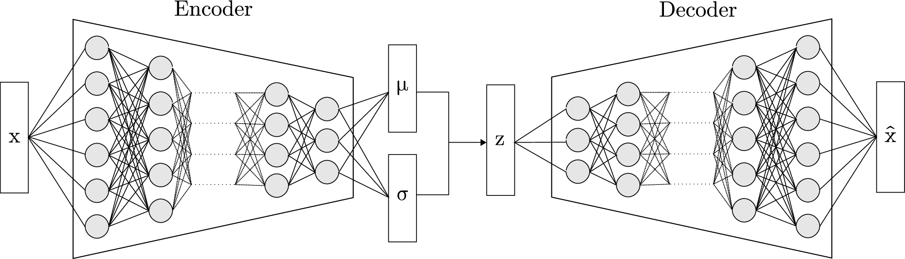

<figure class="photo-img">
  
  <figcaption>
    Photo by <a href="https://unsplash.com/@nhippert?utm_source=unsplash&utm_medium=referral&utm_content=creditCopyText">Nicolas HIPPERT</a> on <a href="https://unsplash.com/photos/city-skyline-with-lights-turned-on-during-night-time-C82jAEQkfE0?utm_source=unsplash&utm_medium=referral&utm_content=creditCopyText">Unsplash</a>
  </figcaption>
</figure>

## La physique valide l'IA — pas l'inverse.

Votre industrie génère des millions de points de données par jour. L'IA promet de les exploiter. Mais quand l'erreur a un coût physique réel — un réacteur nucléaire, un réseau électrique, un procédé chimique — qui s'assure que l'algorithme respecte les lois de votre métier avant de raisonner ?

C'est ce que je fais.

---

## Le Problème

L'IA générative maîtrise le langage. Elle ignore la physique.

Elle hallucine — et dans votre domaine, l'hallucination a un coût réel. La statistique ne suffit pas quand la thermodynamique, la neutronique ou la cinétique chimique imposent des lois non négociables.

Votre enjeu n'est pas "faire de l'IA." C'est faire de l'IA qui respecte la physique de votre installation — et le prouver avant d'investir.

---

## Ce que je fais

Je travaille à la croisée de trois mondes qui communiquent mal : **la physique industrielle**, **l'ingénierie des données** et **l'intelligence artificielle**.

Je conçois des architectures Data & IA où les lois physiques contraignent l'algorithme comme des lois de premier rang — pas comme des post-traitements. Et je fais le pont entre l'expert métier, l'architecte solution et le product owner pour que le prototype devienne un produit.

**Mon métier : cadrage et prototypage Data/IA sous contrainte physique pour les systèmes critiques.**

---

## Les Résultats

Depuis mi-2024, j'interviens en cadrage Data & IA pour la surveillance des réacteurs nucléaires du parc français.

| | Résultat |
|---|---|
| **Validation automatique** | 96,4 % des incohérences physiques résolues sur 11 réacteurs, 3 paliers — sans intervention humaine |
| **Diagnostic IA expert** | < 2 secondes en langage naturel, contraint par l'ontologie physique du domaine |
| **Couverture de tests** | 270+ tests unitaires couvrant chaque règle physique, chaque module, chaque cas limite |

→ Méthodologie détaillée : voir **La Preuve**

---

## Le Filtre CAP

Avant chaque engagement, le projet passe trois questions. Si le projet ne passe pas les trois, je ne le prends pas.

1. **Contraint** — Le problème est-il borné par une loi physique ?
2. **Aride** — Le sujet est-il techniquement négligé ?
3. **Prouvable** — Puis-je livrer un prototype fonctionnel en moins de 3 mois ?

---

## L'Offre — Cadrage & Prototypage Data/IA sous Contrainte Physique

Je dé-risque vos projets Data & IA industriels. Je conçois l'architecture, je construis un prototype fonctionnel qui valide l'approche par la preuve, et je vous livre une base solide pour l'industrialisation — pas un démonstrateur jetable.

- **Cadrage "First Principles"** — Je passe votre projet au Filtre CAP. Si le problème n'est pas contraint par la physique, négligé techniquement et prouvable en < 3 mois, je vous le dis avant de facturer.

- **Pipeline de validation physique** — Ingestion, nettoyage, imputation et validation de vos données de capteurs. Les règles physiques de votre domaine sont codées comme contraintes de premier rang. Le prototype est conçu avec une exigence de production pour faciliter l'intégration par votre équipe de delivery.

- **Knowledge Graph métier** — Modélisation de l'ontologie de votre installation : équipements, capteurs, paramètres physiques, règles de cohérence, corrélations. Ce graphe devient le socle de vérité qui contraint tout raisonnement IA en aval.

- **Assistant IA expert** — Interface conversationnelle où un LLM interroge vos données *à travers* le Knowledge Graph. L'assistant ne peut pas halluciner sur votre domaine : il n'a accès qu'aux faits validés par la physique. Il diagnostique, recommande, extrait — en langage naturel, en temps réel.

**Ce que vous obtenez :** Un prototype fonctionnel validé, une architecture documentée, et la preuve mesurable que l'approche tient — avant d'investir dans l'industrialisation. Preuve de valeur en moins de 3 mois.

**Pour qui :**
- Exploitants de systèmes critiques (nucléaire, énergie, chimie, aéronautique)
- Ingénieries et bureaux d'études avec des données de procédés en séries temporelles
- Tout industriel dont les données capteur doivent respecter des lois physiques avant d'alimenter un modèle

---

## Qui je suis

**Boris Guarisma** — Ingénieur Data & AI, micro-entreprise Qognito.io.

Mon parcours m'a placé à l'intersection de la physique nucléaire, du data engineering haute performance et de l'IA cognitive — un croisement que peu de profils couvrent. C'est cette position qui me permet de parler au neutronicien, au data architect et au product owner dans leur langue respective, et de traduire entre eux.

Ma conviction : dans l'industrie critique, la physique doit valider l'IA — pas l'inverse. Je ne vends pas du temps. Je livre de la preuve — un prototype fonctionnel qui démontre la valeur avant que vous n'investissiez.

Dans le nucléaire français depuis mi-2024.

**Un problème de données critiques où l'IA doit parler physique ?**
→ bguarisma@qognito.io

---

# LA PREUVE

## Le contexte

J'interviens en cadrage (Discovery) de produits numériques pour la surveillance des réacteurs nucléaires du parc français. Mon rôle : concevoir et livrer des **prototypes fonctionnels** qui valident l'approche Data & IA *avant* l'investissement d'industrialisation — dé-risquer par la preuve, pas par le slide.

Chaque prototype est conçu avec une exigence de production (tests, validation physique, architecture pérenne) pour que l'équipe de delivery qui l'intègre dans le produit final parte d'une base solide, pas d'un démonstrateur jetable.

---

## Prototype 1 — Pipeline de Validation Physique

### Le problème

Les données de capteurs nucléaires (puissance, température, bore, grappes de contrôle) arrivent brutes, incomplètes et parfois physiquement incohérentes. Des concentrations de bore négatives, de la puissance affichée quand les grappes sont chutées, des écarts entre le boremètre en ligne et les prélèvements chimistes. Sans validation physique en amont, ces données ne peuvent alimenter aucun modèle ni outil de surveillance fiable.

### L'approche

Un pipeline ETL (Bronze → Silver → Gold) où chaque transformation est contrainte par la physique du réacteur — pas par des heuristiques statistiques.

- **Nettoyage** : chaque variable est imputée selon sa dynamique physique propre — pas de méthode générique appliquée aveuglément
- **Validation** : 3 règles de cohérence physique détectent les incohérences (bornage, impossibilité neutronique, cohérence chimique)
- **Correction** : bornage, recalage du boremètre par assimilation de données chimistes, arbitrage des arrêts mécaniques et chimiques
- **Enrichissement** : filtrage Kalman calibré par phase, gradients cinétiques, classification automatique de 7 phases opérationnelles

### Le résultat

Pipeline validé sur **11 réacteurs du parc, 3 paliers** (900, 1300, 1450 MWe). **96,4 % des incohérences physiques résolues automatiquement.** 270+ tests unitaires. Architecture prête pour intégration produit.

### Détails techniques

> **Data Lake Medallion** sur Apache Arrow partitionné, moteur DuckDB zero-copy (32 threads, 32 GB RAM). Millions de points en sub-seconde.
>
> **4 modules d'imputation physique** : LOCF pour les grappes (mouvement discret par crans), spline cubique pour la puissance (dynamique continue), redondance spatiale pour les températures (4 boucles corrélées), interpolation linéaire pour le bore (cinétique lente).
>
> **Filtrage Kalman** (package dlm) : ordre 0 (random walk, p_factor=4.0) pour la stabilité thermique EPN, ordre 1 (linear growth, p_factor=1.5) pour le suivi de rampes en montée en puissance.
>
> **Arbre de décision physique** classifiant 7 phases opérationnelles (EPN, MEP, CYCLE, TRANSIENT, STRETCH, SHUTDOWN, INVALID) à partir de ~30 constantes calibrées REP 900 MWe sur 6 domaines (neutronique, mécanique, chimie, thermohydraulique, déformation flux, cinétique).

---

## Prototype 2 — Assistant IA Expert Nucléaire

### Le problème

Un ingénieur de surveillance veut interroger les données d'un réacteur en langage naturel : *"La température primaire semble instable, que faire ?"* Les LLM généralistes ne connaissent pas l'ontologie nucléaire — ils ne savent pas quel capteur correspond à "puissance", quelle règle physique s'applique, quel capteur corrélé surveiller. Sans contrainte métier, l'IA hallucine.

### L'approche

Un assistant conversationnel où le LLM ne raisonne pas seul — il interroge un graphe de connaissances qui encode la physique du domaine.

- **Knowledge Graph** modélisant l'ontologie nucléaire : réacteurs, capteurs, paramètres physiques, règles, corrélations quantifiées
- **3 outils spécialisés** (Tool Calling) : recherche sémantique de capteurs, extraction haute performance de séries temporelles, diagnostic d'anomalies via les règles physiques
- **Intelligence métier** : substitution automatique selon la phase opérationnelle, recommandation de capteurs corrélés pour le diagnostic, adaptation au palier du réacteur

### Le résultat

L'ingénieur pose une question en français, l'assistant identifie le capteur, applique la règle physique, extrait les données, recommande le capteur corrélé — **en moins de 2 secondes**. L'assistant ne peut pas halluciner : il n'a accès qu'aux faits validés par le graphe. Prototype validé, en attente d'intégration produit.

→ Méthodologie de conception du Knowledge Graph : [[lire l'article complet](https://blog.bguarisma.com/quand-ia-rencontre-physique-knowledge-graph)

### Détails techniques

> **Knowledge Graph Neo4j** : 11 réacteurs, 10 paramètres physiques, 9+ capteurs par réacteur, 5 règles physiques, 5 corrélations quantifiées. Contraintes d'unicité et index sémantiques. Requêtes < 100ms.
>
> **LLM** : Claude 3.5 Haiku via ellmer (orchestration Tool Calling). Prompt système expert calibré sur le domaine nucléaire.
>
> **Visualisation** : Dashboard Shiny haute performance, graphiques dygraphs interactifs, shading automatique des phases opérationnelles, marqueurs d'anomalies.
>
> **Sécurité** : validation anti-injection SQL, données filtrées par le Knowledge Graph, aucun accès direct du LLM aux données brutes.

---

## Les Principes de Conception

Ces principes ne sont pas des slogans. Ce sont les règles de conception que j'applique. Chacune est adossée à un choix technique vérifiable.

### La Physique avant le Verbe (Physics First)

L'IA actuelle est probabiliste ; l'industrie est déterministe. Pour les systèmes critiques, la statistique ne suffit pas.

<figure class="photo-img">
  
  <figcaption>
    Photo by <a href="https://unsplash.com/@bkaraivanov?utm_source=unsplash&utm_medium=referral&utm_content=creditCopyText">Bozhin Karaivanov</a> on <a href="https://unsplash.com/photos/a-close-up-of-a-piece-of-paper-with-writing-on-it-dvMJR9-Drbs?utm_source=unsplash&utm_medium=referral&utm_content=creditCopyText">Unsplash</a>
  </figcaption>
</figure>

*En pratique :* Aucune donnée brute n'est confiée à un algorithme. Le pipeline valide d'abord par la physique (bornage, cohérence neutronique, recalage chimique par assimilation de données), puis impute selon la dynamique propre de chaque variable (inertie thermique, cinétique du bore, mouvement discret des grappes). L'IA intervient *après* cette couche de vérité physique — contrainte par un graphe de connaissances qui encode les lois du domaine.

### La Sobriété comme Architecture (Data Sobriety)

Une mauvaise architecture de données est une dette énergétique et cognitive. Les détails arides — nettoyage, optimisation de flux, structures de partitionnement — sont là où se trouve l'impact réel.

*En pratique :* Architecture zero-copy traitant des téraoctets sans duplication mémoire. Partitionnement intelligent réduisant les données scannées d'un facteur 10 à 100x. Sub-seconde pour 1 million de points. Pas de GPU, pas de cluster — un seul serveur bien architecturé.

### Le Filtre CAP (Pragmatisme de Combat)

Avant chaque engagement, trois questions.

1. **Contraint** — Le problème est-il borné par une loi physique ? Thermodynamique, neutronique, cinétique chimique, mécanique — si la réalité impose une borne que l'algorithme ne peut pas ignorer, c'est mon terrain. Si le problème est purement narratif, l'IA générique suffit.

2. **Aride** — Le sujet est-il techniquement négligé ? La valeur réelle se cache dans les problèmes ingrats : nettoyage de séries temporelles, recalage de capteurs, validation de cohérence physique. Si tout le monde s'y précipite, c'est déjà commoditisé.

3. **Prouvable** — Puis-je démontrer la faisabilité par un prototype fonctionnel en moins de 3 mois ? Si la donnée existe et la physique est modélisable, je livre une preuve — pas une promesse.

---

## Stack Technique

| Couche | Technologies |
|---|---|
| **Data Engineering** | Apache Arrow, DuckDB (zero-copy, 32 threads), Parquet partitionné, architecture Medallion (pins) |
| **Validation Physique** | Règles déterministes (neutronique, chimique, thermique), filtrage Kalman (dlm), gradients cinétiques |
| **Knowledge Graph** | Neo4j (ontologie métier, règles physiques, corrélations, contraintes d'unicité, index sémantiques) |
| **IA Cognitive** | Anthropic Claude (Tool Calling), ellmer (orchestration LLM), RAG contraint par graphe |
| **Visualisation** | Shiny Dashboard, dygraphs (séries temporelles interactives), Plotly |
| **Qualité** | testthat (270+ tests), renv (reproductibilité), validation anti-injection SQL |
| **Langages** | R, Python (reticulate) |

---

# RECHERCHE

## PI-VAE — Données Synthétiques Physiquement Cohérentes

Programme de recherche personnel, distinct des engagements clients.

### Le problème

Les données nucléaires sont sensibles, restreintes, et les phases opérationnelles rares (transitoires, arrêts à chaud) sont sous-représentées. Entraîner des modèles ML sur ces données est soit impossible (compliance), soit biaisé (déséquilibre de classes).

### L'approche — Physics-Informed Variational Auto-Encoder

<figure class="scientific-img">
  
  <figcaption>Scientific Reports (Sci Rep) ISSN 2045-2322 (online)</figcaption>
</figure>

- **Encodeur GRU** capturant les dépendances temporelles longues (cycle de combustible) et courtes (transitoires, suivi de charge)

- **Échantillonnage MCMC** dans l'espace latent pour garantir la continuité physique entre séquences générées

- **Validation physique de la génération** : le modèle est évalué sur la conservation des corrélations physiques — pas sur l'erreur de reconstruction

### Le statut

Stade VAE (architecture de base). Prochaine étape : intégration des contraintes physiques dans la fonction de perte et validation sur données Gold.

### La valeur à terme

Un générateur synthétique validé physiquement ouvre la porte à l'entraînement de modèles sans accès aux données réelles (export, formation), à la simulation de scénarios opérationnels (stress tests), et à l'augmentation de datasets pour les phases rares.

---

## Vision

**En cours** — Mission de cadrage Data & IA dans le nucléaire français. Conception et livraison de prototypes fonctionnels. Développement du PI-VAE.

**À terme** — Extension de l'architecture (pipeline + Knowledge Graph + assistant) comme solution reproductible pour d'autres exploitants de systèmes critiques. Poursuite de la R&D vers un générateur synthétique industrialisable.

