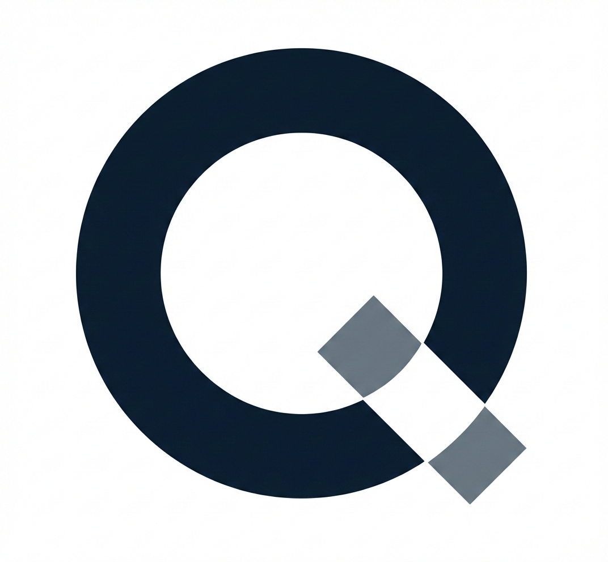
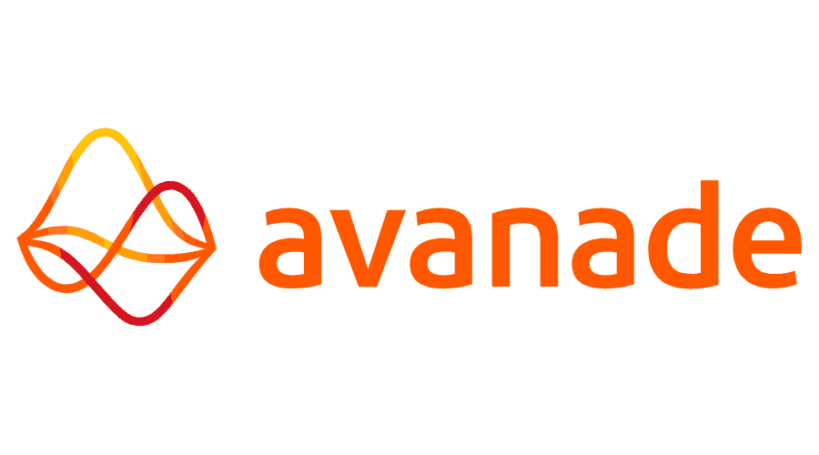
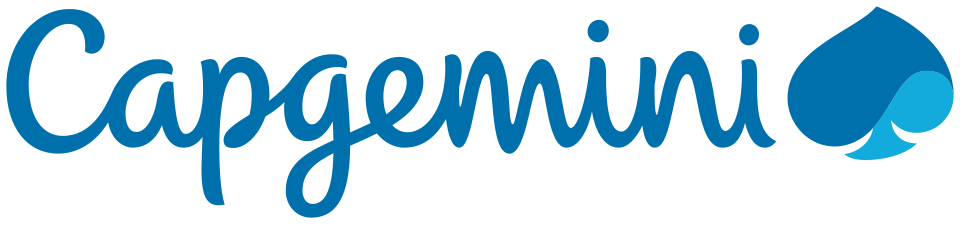
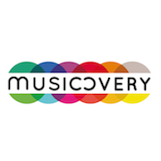
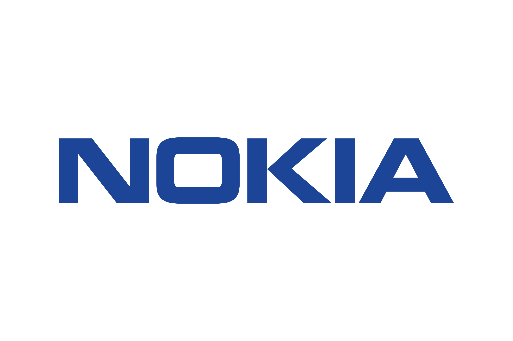
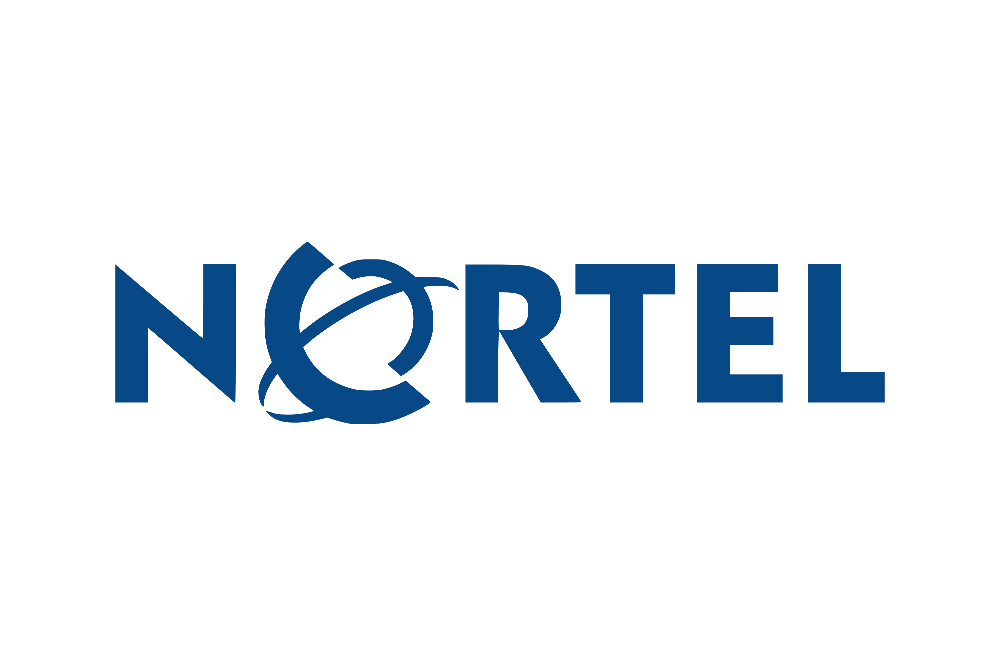
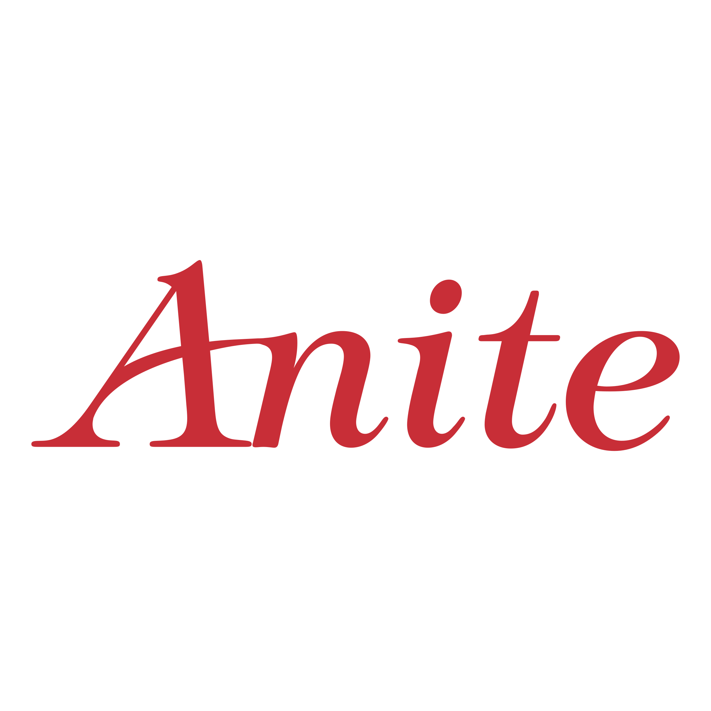

# Parcours

Plus de **25 ans d'expérience** à l'intersection de l'ingénierie, de la Data Science et de l'Intelligence Artificielle.
Un parcours construit dans les environnements les plus contraints — télécoms, finance, institutions internationales, nucléaire.

---

## Expérience professionnelle

{ .company-logo }

### Fondateur & Consultant IA
**Qognito.io** · juillet 2025 – présent · Puteaux (92)

Conseil indépendant en Data & IA, spécialisé dans le cadrage et le prototypage sous contrainte physique et réglementaire pour les systèmes critiques.

**Mission principale — Appui Technique IA :**
*Équipe multi-disciplinaire de cadrage produit · un acteur majeur de la filière nucléaire française*

- Identification et priorisation des opportunités IA sur **4 domaines métier simultanément** (25+ opportunités évaluées)
- Études de faisabilité formelles : architecture, gouvernance des données, conformité (Export Control, EU AI Act, sûreté nucléaire)
- Design d'architectures IA spécialisées : Knowledge Graphs, modèles physiques (PINN, Filtre de Kalman), e-monitoring multi-échelles, agents LLM
- Prototypage (POC) et passation vers les équipes delivery (blueprints phasés POC → MVP → Pilote)
- Acculturation des équipes produit à l'IA : formation, transition paradigmatique déterministe → probabiliste

*Stack (production) :*  
*Dataiku DSS, AWS, GCP, Open Source (on-premise)*

*Stack (prototype/POC) : Posit Shiny (packages R/Python), Claude 3.5 Haiku, DuckDB, Neo4j*

---

{ .company-logo }

### CTO Agence Paris
**Ippon Technologies** · juin 2024 – juin 2025 · Paris

Direction technique de l'agence parisienne d'une ESN spécialisée Data & IA.

- Pilotage de la stratégie commerciale et technique de l'agence
- Encadrement de managers seniors et de leurs équipes techniques
- Définition de la vision et des **OKR trimestriels de la Practice IA**
- Recrutement, intégration et fidélisation des talents

---

{ .company-logo }

### Practice Lead France — Intelligence Artificielle
**Avanade** *(JV Accenture × Microsoft)* · mars 2019 – mai 2024 (5 ans) · Paris

Structuration et pilotage de la Practice IA France, **de 4 à 32 consultants**.

- Projets IA pour un acteur majeur de l'énergie : NLP (LegalBERT), veille de risques (Knowledge Graph Neo4j), Knowledge Mining
- Projet GenAI pour la **Cour Pénale Internationale** : RAG pour détection d'incohérences factuelles
- Développement d'accélérateurs : MLOps Accelerator, Prompt Injection Tests, Swarm Portfolio Optimizer
- Formations prompt engineering et IA pour des grands comptes (énergie, assurance)

*Stack : Microsoft Azure, Azure Databricks, Azure OpenAI, Neo4j, LegalBERT, Doccano*

---

{ .company-logo }

### Senior Data Scientist
**Capgemini** *(Service Insights & Data)* · septembre 2016 – février 2019 · Suresnes (92)

Conception et déploiement de solutions IA pour la détection de fraude et l'innovation industrielle.

- **CNAF** : détection de connexions suspectes (graphe Neo4j), prédiction de l'indu (réseaux bayésiens, clustering Spark)
- **Douanes françaises** : détection d'anomalies sur les déclarations de marchandises, benchmark de recherche approchante
- **Projets CIR** (Lead Data Scientist) : détection d'anomalies aéronautique, optimisation de portefeuille par Swarm Intelligence (MOPSO), maintenance prédictive industrielle
- Contribution aux objectifs Crédit d'Impôt Recherche — **atteints deux années consécutives**

*Stack : R / sparklyr / Shiny, H2O, Spark, Hadoop, Neo4j*

---

{ .company-logo }

### Data Scientist & Consultant Big Data
**Musicovery** · avril 2014 – août 2016 · Paris

Mission freelance pour un service de streaming musical — machine learning appliqué à la recommandation musicale.

- Segmentation comportementale des utilisateurs (clustering, variables de découverte musicale)
- Knowledge Graph Neo4j + API Java : solution haute performance pour la recommandation en temps réel
- Formalisation d'un test A/B (approches fréquentiste et bayésienne)

*Stack : AWS EC2, Hadoop, Spark, R, Shiny, Neo4j*

---

{ .company-logo }
{ .company-logo }
{ .company-logo }
{ .company-logo }

### Ingénieur Télécommunications
**Nokia · Nortel · Anite · NET2S · Steria** · octobre 1998 – septembre 2013 (15 ans) · Région parisienne & Toulouse

Quinze ans d'ingénierie réseau dans les environnements les plus exigeants d'Europe — avant la data, la physique des signaux.

- **Nokia** *(2008–2013)* — Senior Network Architect : design du testbed ayant remporté l'appel d'offre **Free Mobile** ; avant-vente grands comptes en Europe
- **Nortel** *(2004–2008)* — Ingénieur VoIP & GSM-R : introduction de la technologie **GSM-Railways en France** ; spécifications techniques commutateur et base d'abonnés
- **Anite / Delta Partners** *(2001–2003)* — Avant-vente : progiciel de planification réseaux, succès chez British Telecom et Alcatel
- **NET2S / Steria** *(1998–2001)* — Formateur certifié GSM/2G (français, anglais, espagnol) ; intégration de plateformes de gestion de performance réseau

---

## Formation

| Année | Diplôme |
|-------|---------|
| 2004 | **DEA Traitement des Images et du Signal** — ENSEA, Cergy · réseaux de neurones, réseaux bayésiens, théorie de l'information |
| 2014 | **Parcours certifiant Data Science & Big Data** — CNAM Paris + certifications Cloudera (Hadoop Developer & Admin) + MOOCs Coursera |
| 1998 | **DESS Nouvelles Technologies et Aide à la décision** — Université de la Méditerranée, Marseille |
| 1997 | **Maîtrise Systèmes de Télécommunications et Réseaux Informatiques** — Université Toulouse III |

---

## Langues

**Trilingue** — Français (courant) · Anglais (courant) · Espagnol (langue maternelle)

---

*CV complet disponible sur demande — [bguarisma@qognito.io](mailto:bguarisma@qognito.io)*
